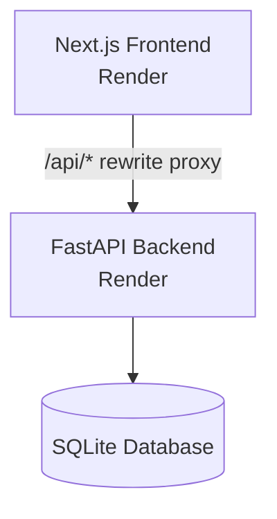
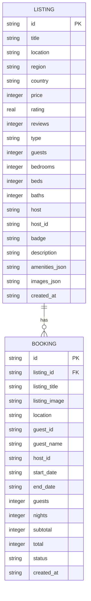

# Airbnb Clone

A full-stack Airbnb-style stay marketplace built with **Next.js 15, TypeScript, FastAPI, Pydantic, and SQLite**.

## Project Links

| Resource | Link |
|---|---|
| Live Application | https://airbnb-frontend-7fi6.onrender.com |
| Backend API | https://airbnb-backend-ykcw.onrender.com |
| GitHub Repository | https://github.com/Paridhi81/airbnb-clone |

## Features

- Photo-forward marketplace home with listing grid and sticky header
- Category rail, search, and property filters
- Price, property type, and guest-capacity filtering
- Wishlist / favourites persisted in browser storage
- Listing detail pages with gallery, amenities, host card, and reviews summary
- Date-range picker and guest stepper
- Live booking price breakdown
- Availability checking and guest-capacity validation
- Booking overlap prevention
- Mocked checkout with no real payment processing
- My Trips view for the demo guest
- Host dashboard with create, edit, and delete listing functionality
- Upcoming booking management for hosts
- Leaflet and OpenStreetMap integration
- Experiences and Services navigation with Coming Soon flows
- Seeded SQLite database with 8 sample stays and Unsplash photos
- Responsive Airbnb-inspired UI

## System Architecture



The frontend does not communicate with SQLite directly.

Next.js `rewrites()` proxies `/api/*` requests to the FastAPI backend, which handles validation, booking logic, and database operations.

On first boot, FastAPI creates the required tables and seeds 8 listings when the database is empty.

## Database Schema

The marketplace data follows the relationship:

**Listing → Booking**



Full DDL with indexes is available in [`backend/schema.sql`](./backend/schema.sql).

## Core API

| Method | Endpoint | Description |
|---|---|---|
| GET | `/api/health` | Health check |
| GET | `/api/listings` | List stays with `q`, `category`, and `maxPrice` filters |
| GET | `/api/listings/{id}` | Listing detail |
| POST | `/api/listings` | Create a host listing |
| PUT | `/api/listings/{id}` | Update a listing |
| DELETE | `/api/listings/{id}` | Delete a listing |
| GET | `/api/listings/{id}/availability` | Blocked date ranges for a stay |
| GET | `/api/bookings?guestId=guest-demo` | Guest trips |
| POST | `/api/bookings` | Create a booking with validation |
| GET | `/api/host/listings?hostId=host-demo` | Host listings and bookings |

### Create Booking

```json
{
  "listingId": "stay-01",
  "startDate": "2026-10-10",
  "endDate": "2026-10-13",
  "guests": 2,
  "guestId": "guest-demo",
  "guestName": "Alex Morgan"
}
```

### Create Listing

```json
{
  "title": "Lakeside cabin",
  "location": "Nainital, Uttarakhand",
  "price": 5000,
  "type": "Cabin",
  "guests": 4,
  "bedrooms": 2,
  "beds": 2,
  "baths": 1,
  "description": "Quiet stay by the water",
  "amenities": ["Wifi", "Kitchen", "Fireplace"],
  "images": ["https://images.unsplash.com/..."],
  "hostId": "host-demo"
}
```

## Data Models

The backend uses **Pydantic v2** for request validation.

| Model | Purpose |
|---|---|
| `ListingCreate` | Creates a new host listing |
| `ListingUpdate` | Partially updates an existing listing |
| `BookingCreate` | Creates a booking with date and guest details |

Responses return serialized listing and booking dictionaries, with amenities and images expanded from their JSON database columns.

## Tech Stack

| Layer | Technology |
|---|---|
| Frontend | Next.js 15 (App Router) |
| Language | TypeScript |
| Styling | Tailwind CSS |
| UI primitives | Radix / shadcn-style components |
| Icons | lucide-react |
| Animation | Framer Motion |
| Maps | Leaflet + react-leaflet |
| Data fetching | React Query / SWR / fetch |
| Backend | FastAPI |
| Validation | Pydantic v2 |
| Database | SQLite |
| Frontend Deployment | Render |
| Backend Deployment | Render |

## Project Structure

```text
airbnb-clone/
├── frontend/
│   ├── app/                 # App Router pages, layout, globals
│   ├── components/roamly/   # Marketplace UI components
│   ├── lib/                 # Types, seed fallbacks, filters, formatters
│   ├── public/              # Logo and navigation assets
│   ├── next.config.js       # /api/* → FASTAPI_URL rewrites
│   ├── package.json
│   └── .env.example
├── backend/
│   ├── main.py              # FastAPI routes, schema init, seed data
│   ├── schema.sql           # SQLite DDL reference
│   ├── requirements.txt
│   ├── Dockerfile
│   └── .env.example
├── docker-compose.yml
├── package.json
├── SETUP.md
└── README.md
```

## Local Setup

### Prerequisites

- Node.js ≥ 18 and Yarn 1.x
- Python ≥ 3.9

### Backend

```bash
cd backend
python -m venv ../.venv

# Windows:
..\.venv\Scripts\activate

# macOS / Linux:
# source ../.venv/bin/activate

pip install -r requirements.txt
cp .env.example .env
uvicorn main:app --host 127.0.0.1 --port 8001 --reload
```

Configure `backend/.env`:

```env
SQLITE_DB_PATH=./roamly.db
CORS_ORIGINS=http://localhost:3000
```

### Frontend

Open a new terminal from the repository root:

```bash
cp frontend/.env.example frontend/.env
yarn install
yarn --cwd frontend install
yarn --cwd frontend dev
```

Configure `frontend/.env`:

```env
NEXT_PUBLIC_BASE_URL=http://localhost:3000
FASTAPI_URL=http://127.0.0.1:8001
CORS_ORIGINS=http://localhost:3000
```

### Local URLs

| Service | URL |
|---|---|
| Frontend | http://localhost:3000 |
| Backend | http://127.0.0.1:8001 |
| API Health | http://127.0.0.1:8001/api/health |
| Listings | http://127.0.0.1:8001/api/listings |

> **Important:** `FASTAPI_URL` must match the Uvicorn port. If it does not, the frontend may fall back to built-in seed data and bookings / host CRUD will not persist through the backend.

## Docker

Run both services together:

```bash
docker compose up --build
```

Then open `http://localhost:3000`.

## Deployment

### Backend

The FastAPI backend is deployed on **Render** as a Python web service.

```text
Root Directory: backend
Build Command: pip install -r requirements.txt
Start Command: uvicorn main:app --host 0.0.0.0 --port $PORT
```

Required environment variables:

```env
CORS_ORIGINS=https://airbnb-frontend-7fi6.onrender.com
SQLITE_DB_PATH=/tmp/roamly.db
```

Backend:

https://airbnb-backend-ykcw.onrender.com

> Visiting `/` returns `{"detail":"Not Found"}` — this is expected. Use the `/api/...` endpoints.

### Frontend

The Next.js application is deployed on **Render** as a Node web service.

```text
Root Directory: frontend
Build Command: yarn install && yarn build
Start Command: yarn start
```

Required environment variables:

```env
FASTAPI_URL=https://airbnb-backend-ykcw.onrender.com
NEXT_PUBLIC_BASE_URL=https://airbnb-frontend-7fi6.onrender.com
CORS_ORIGINS=https://airbnb-frontend-7fi6.onrender.com
```

Frontend:

https://airbnb-frontend-7fi6.onrender.com

## Deployment Challenges

| Challenge | Description |
|---|---|
| Render Cold Start | The free backend may take 30–60 seconds to wake after inactivity. |
| SQLite | `/tmp` storage can reset after restart; persistent storage is preferable for lasting data. |
| CORS | Separate frontend and backend deployments require matching CORS configuration. |
| API Proxy | The frontend depends on `FASTAPI_URL` being correctly configured. |
| Monorepo Roots | Render requires separate `frontend` and `backend` root directories. |

## Assignment Focus

| Area | Implementation |
|---|---|
| Full Stack | Next.js frontend with FastAPI backend |
| API Design | REST APIs with Pydantic request models |
| Database | Relational listings and bookings using SQLite |
| Marketplace | Browse, search, filtering, and listing details |
| Booking Engine | Date validation, capacity checks, and overlap prevention |
| Hosting | Host CRUD and upcoming booking management |
| UX | Airbnb-inspired responsive interface and mocked checkout |
| Maps | Leaflet and OpenStreetMap integration |
| Deployment | Render frontend and backend from one monorepo |

## Demo Accounts

| Role | ID | Notes |
|---|---|---|
| Guest | `guest-demo` / Alex Morgan | Used for My Trips and bookings |
| Host | `host-demo` | Used for Host dashboard CRUD |

No OAuth or real authentication layer is included. Roles are demo switches for the assignment.
